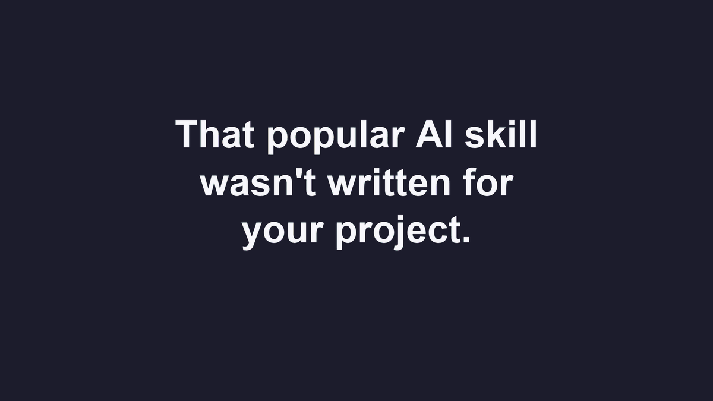

<div align="center">

# skilladopt

**Don't install agent skills. Adopt them.**

[](https://www.npmjs.com/package/skilladopt)
[](https://github.com/kks0488/skilladopt/actions/workflows/ci.yml)
[](LICENSE)

[English](README.md) · [한국어](README.ko.md)



</div>

Every skill you copy from GitHub for Claude Code or Codex was written for someone else's project.
It tells your agent to use their tools, run their commands and follow their rules.

skilladopt fits the skill to your project before it goes in, writes down why each line changed,
and tells you which lines to look at again when your project changes.

## Quick start

Run this once:

```bash
npx skilladopt setup
```

Then ask Claude Code or Codex in any project:

> Add a frontend design skill to this project.

Your agent finds a skill, fits it to your project with skilladopt, shows you what changed and asks before installing.

Already know which skill you want? Name it yourself:

```bash
npx skilladopt anthropics/skills frontend-design
```

> [!NOTE]
> You need Node 20 or newer and either [Claude Code](https://claude.com/claude-code) or [Codex](https://github.com/openai/codex). One of them does the reading.

## What changes in the skill

| The original skill says | After skilladopt | Why |
|---|---|---|
| "Style it with Tailwind." | *(removed)* | Tailwind isn't in your `package.json` |
| "Run the tests." | "Run `npm test`." | That's your test script |
| "Delete unused files." | "Delete unused files, but never in `docs/`." | Your `AGENTS.md` says so (you approve this one) |

Every row is saved with its evidence. A skill that doesn't fit your project at all is turned down, and nothing is installed.

## A week later

Your teammate renames the test script and adds a rule. Run:

```bash
npx skilladopt impact
```

It points at the one decision out of 25 that lost its evidence and the new rule that might clash. You re-check that line and leave the rest alone.

## See it run


<sub>A real run with the Codex worker. The ~40 seconds it spends reading the skill are cut. Script: <a href="assets/demo.tape">assets/demo.tape</a>.</sub>

## Commands

| Command | What it does |
|---|---|
| `skilladopt setup` | Teach Claude Code and Codex to adopt skills, so you can just ask |
| `skilladopt <repo> [skill]` | Fit a skill to this project and install it |
| `skilladopt impact` | Show which decisions your project changes affect (`--upstream` also checks the original skill) |
| `skilladopt update <name>` | Re-fit to the latest version of the original, reusing decisions that still hold |
| `skilladopt status` | List adopted skills and any hand edits |
| `skilladopt doctor` | Check that the AI worker is isolated on your machine |

Outside an interactive terminal (scripts, CI, agents) it stops before installing. Finish with `skilladopt review last` and `skilladopt apply last`.
`setup` installs the [skilladopt agent skill](skill/skilladopt/SKILL.md) into `~/.claude/skills` and `~/.agents/skills`.

<details>
<summary><b>How it decides</b></summary>

Each paragraph of the skill gets one decision. Every decision that matters cites something in your project: a dependency, an npm script, a line of `AGENTS.md`.

| Decision | Meaning | What the code checks |
|---|---|---|
| `keep` | stays as written | nothing to check |
| `bind` | a generic command becomes yours | exactly one command or path is inserted, the rest of the sentence is identical, and it exists in your project |
| `rewrite` | the intent applies, the details don't | you always see it before install |
| `drop` | doesn't apply here | a "stack mismatch" must name something your project lacks; a conflict must cite the exact `AGENTS.md` line |
| `review` | the AI wasn't sure | you decide |

Paragraphs that carry a duty (a prohibition, an approval, a verification step) are never removed or rewritten without you.
`impact` re-checks every decision that recorded evidence and lists instruction lines added since adoption. Advice kept word for word has nothing to re-check.
</details>

<details>
<summary><b>Safety</b></summary>

- Nothing from a skill is executed. Files are read through the GitHub API at a pinned commit.
- Hidden Unicode, control characters, symlinks, path tricks and skills that need scripts are refused before any AI sees them.
- The AI worker gets the skill text and a short summary of your project, nothing else. `claude` runs with `--safe-mode` and no tools; `codex` runs in a read-only sandbox with no network tools and no access to your home folder. `skilladopt doctor` probes this on your machine. A probe is evidence, not proof.
- Code checks the worker's answer and catches missing decisions, fake evidence, removed duties, inserted commands, new links, secrets and hidden comments.
- Installs are transactional. A failed install rolls back, and folders you edited by hand are left alone unless you pass `--force`.
- Adapted copies keep the original license and notice. Skills without a recognised permissive license need `--private`, which keeps them out of git.
</details>

<details>
<summary><b>Files it writes</b></summary>

```
.agents/skills/<name>/      the adopted skill for Codex (+ NOTICE.md)
.claude/skills/<name>/      the same for Claude Code     (--target codex|claude|both)
.skilladopt/lock.json       source, pinned commit, hashes
.skilladopt/decisions/      every decision and its evidence
.skilladopt/upstream/       the original as adopted
.skilladopt/approved/       exactly what you approved
```
</details>

<details>
<summary><b>Limits (v0.1)</b></summary>

- Markdown skills only. Skills that need scripts are refused. Markdown docs that a skill links to elsewhere in the same repository come along (one level deep, never other skills).
- The AI sees the first 400 lines of your instruction files, and you get a note when there are more.
- Time saved has not been measured yet. If you try it, open an issue with what worked and what didn't.
- Tested with Codex CLI 0.161 and Claude Code 2.1 on macOS. The test suite runs on Linux with Node 20 and 24.
</details>

## Prior art

Tailoring skills with a prompt has been done before: `/skillify` in [makerskills](https://github.com/coreyhaines31/makerskills) and skillsmith's `upstream-review`. [rulesync](https://github.com/dyoshikawa/rulesync) and [agents-lint](https://github.com/giacomo/agents-lint) work on neighbouring problems. skilladopt adds evidence for every decision and tells you which ones a change has invalidated.
